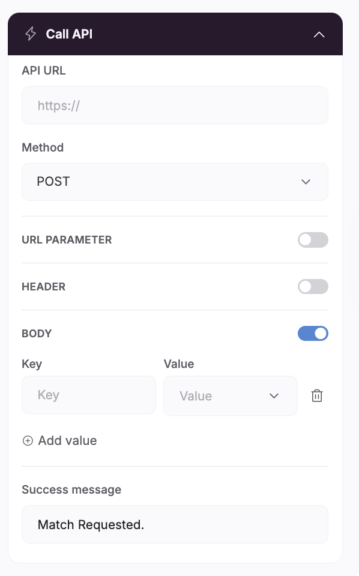

# Potencia API Middleware

This middleware serves as a bridge between Softr webhooks and Airtable, providing custom record logic and data transformation capabilities.

## Why This Middleware is Necessary

**Softr Webhook Limitations**: Softr's webhook system only supports flattened request bodies (simple key-value pairs), as shown in their Call API interface:



This creates a problem when working with Airtable, which often requires:

- Complex data structures
- Record relationships (arrays/lists)
- Computed fields based on input data
- Custom business logic before record creation

## Solution

This AWS Lambda-based middleware:

1. **Receives flattened data** from Softr webhooks
2. **Applies custom transformations** using Pydantic models
3. **Formats data appropriately** for Airtable's API requirements
4. **Sends structured data** to Airtable

## Example: Match Records

For the `Matches` table, this middleware:

- Converts single `Learner` and `Tutor` strings to required list format
- Calculates `Overlapping Available Time Slots` by intersecting learner and tutor time slots
- Excludes intermediate time slot fields from the final record
- Maintains proper field naming conventions for Airtable

### Input (from Softr):
```json
{
  "Learner": "recJpeIQuMnAlfJ1R",
  "Tutor": "recuUhUFHYIQ6B3De",
  "Learner Available Time Slots": ["rec1", "rec2", "rec3"],
  "Tutor Available Time Slots": ["rec2", "rec4", "rec5"],
  "Approval Status": "Requested"
}
```

### Output (to Airtable):
```json
{
  "records": [{
    "fields": {
      "Learner": ["recJpeIQuMnAlfJ1R"],
      "Tutor": ["recuUhUFHYIQ6B3De"],
      "Overlapping Available Time Slots": ["rec2"],
      "Approval Status": "Requested"
    }
  }]
}
```

## Architecture

- **API Gateway**: REST API with OpenAPI specification
- **Lambda Authorizer**: Validates API tokens from Secrets Manager (`/api/token`)
- **Main Lambda**: Handles Airtable operations using credentials from Secrets Manager (`/api/token/airtable`)

## Endpoints

- `POST /airtable/{tableName}` - Create records in specified table

## Setup

### 1. Create Secrets in AWS Secrets Manager

Create two secrets manually:

**Authorization Secret** (`/api/token`):
```json
{
  "api_key": "your-secure-api-key-here"
}
```

**Airtable Secret** (`/api/token/airtable`):
```json
{
  "token": "your-airtable-personal-access-token",
  "base_id": "your-airtable-base-id"
}
```

### 2. Build Lambda Functions

```bash
./build.sh
```

### 3. Deploy with Terraform

```bash
terraform init
terraform plan
terraform apply
```

## Usage

### Authentication

Include your API key in the Authorization header:
```
Authorization: your-secure-api-key
```

### Example Request

```bash
curl -X POST https://your-api-gateway-url/prod/airtable/customers \
  -H "Authorization: your-secure-api-key" \
  -H "Content-Type: application/json" \
  -d '{
    "fields": {
      "Name": "John Doe",
      "Email": "john@example.com"
    }
  }'
```

## Files

- `providers.tf` - AWS provider configuration
- `variables.tf` - Terraform variables
- `main.tf` - Main infrastructure resources
- `outputs.tf` - Output values
- `openapi.yaml` - API specification
- `lambda-authorizer/` - Custom authorizer function
- `lambda-main/` - Main API handler function
- `build.sh` - Build script for Lambda functions
